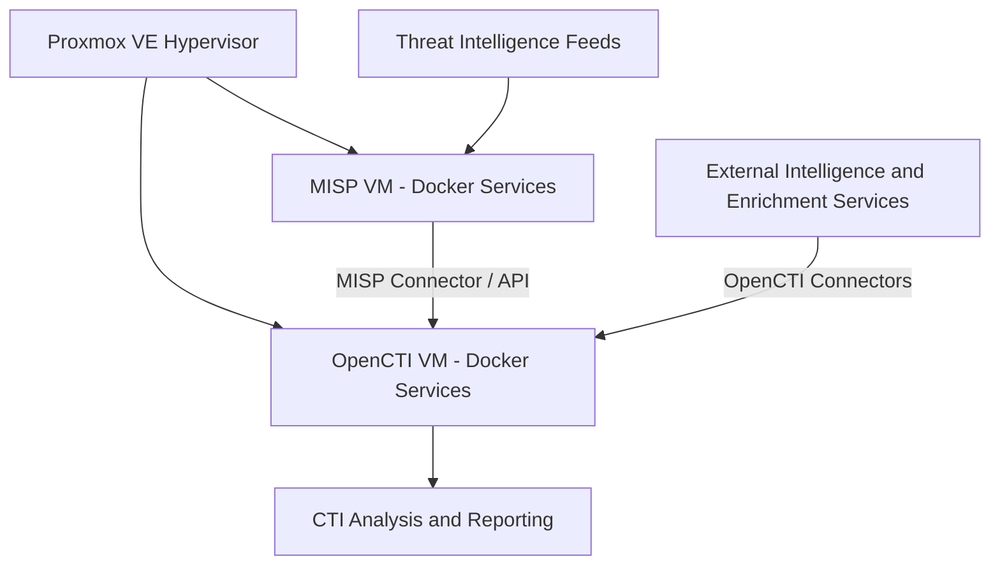

# CTI Lab Architecture

This directory contains sanitized architecture diagrams and documentation for the self-hosted OpenCTI and MISP threat intelligence environment.

## Logical Architecture

```mermaid
flowchart TB
    P["Proxmox VE Hypervisor"]
    M["MISP VM - Docker Services"]
    O["OpenCTI VM - Docker Services"]
    F["Threat Intelligence Feeds"]
    E["External Intelligence and Enrichment Services"]
    A["CTI Analysis and Reporting"]

    P --> M
    P --> O
    F --> M
    M -->|"MISP Connector / API"| O
    E -->|"OpenCTI Connectors"| O
    O --> A
```
